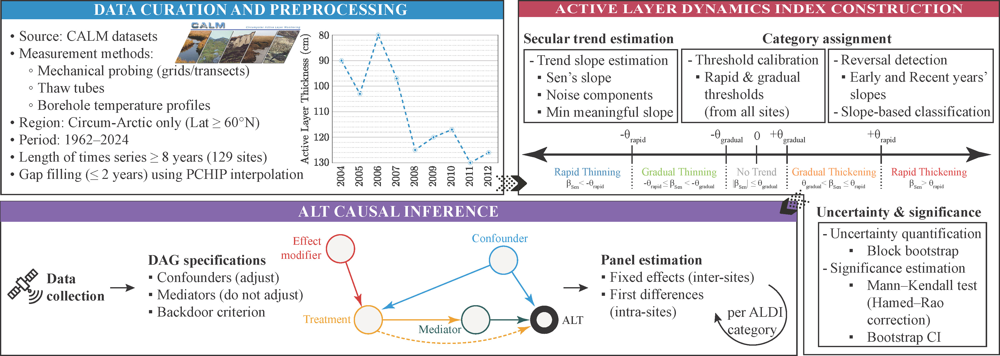

# Active Layer Dynamics Index

Active layer thickness (ALT) is a key indicator of permafrost response to environmental change. However, its long-term variation across regions can be driven by multiple geospatial factors whose relative contributions remain difficult to disentangle. In this work, we propose a framework combining two processes: long-term trajectory classification and causal inference. Accordingly, we introduce the Active Layer Dynamics Index (ALDI), categorizing ALT time series into six classes of direction and rate of change: Rapid and Gradual Thickening, Rapid and Gradual Thinning, Transitional and No Trend. ALDI relies on nonparametric trend detection, reversal identification, and bootstrap uncertainty quantification. We then conduct causal inference using site fixed-effects and first-difference estimators to examine how environmental drivers vary across ALDI classes. Applied to 129 CALM network sites (1990–2024), ALDI identifies a 3.5:1 thickening-to-thinning ratio across the pan-Arctic and substantial regional heterogeneity. In terms of causality, thermal forcing dominates at thickening sites but is absent in thinning and transitional regimes, where hydrological and disturbance processes prevail. These class-dependent relationships were not detectable in pooled analyses, underscoring the need for trajectory-aware analysis in permafrost research.
